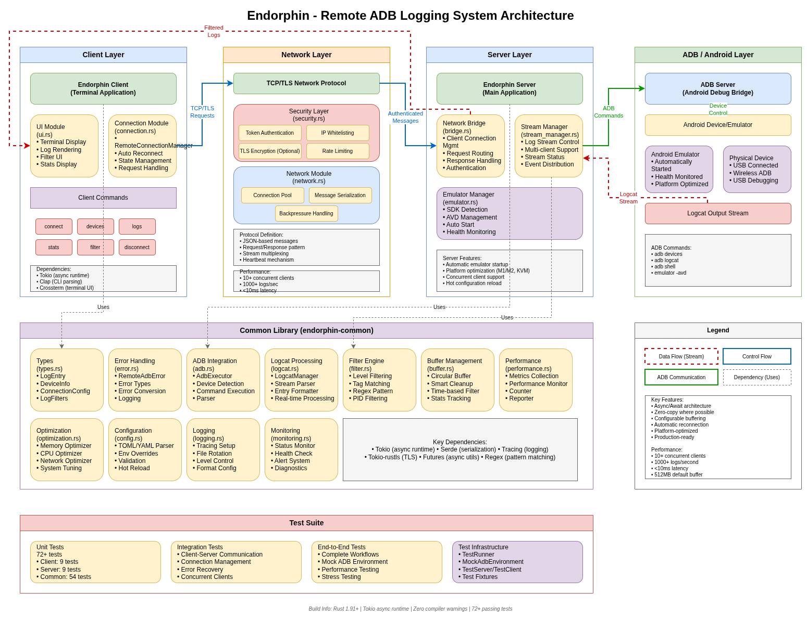

# Endorphin

A Rust-based remote Android Debug Bridge (ADB) logging system that enables real-time log monitoring across networks. This system allows one host to connect to another host's Android emulator over the network and stream logs in real-time.

## Features

- **🚀 Automatic Emulator Management**: Automatically checks and starts Android emulators
- **🌐 Remote ADB Access**: Connect to Android emulators over the network
- **📱 Real-time Log Streaming**: Stream logcat output in real-time with filtering
- **🔒 Security**: IP whitelisting and token-based authentication
- **⚡ High Performance**: Async I/O with Tokio for concurrent connections
- **🎛️ Advanced Filtering**: Filter logs by level, tag, PID, and regex patterns
- **📊 Performance Monitoring**: Built-in performance metrics and monitoring
- **⚙️ Flexible Configuration**: TOML/YAML config files with CLI overrides
- **🔄 Hot Reloading**: Runtime configuration updates without restart

## Project Structure

```
├── Cargo.toml                    # Workspace configuration
├── config.toml                   # Server configuration file
├── start_remote_adb_server.sh    # Convenient startup script
├── endorphin-client/             # Client application
│   ├── Cargo.toml
│   └── src/
│       ├── main.rs               # Client entry point
│       ├── lib.rs                # Client library
│       ├── connection.rs         # Remote connection management
│       └── ui.rs                 # Terminal UI
├── endorphin-server/             # Server application
│   ├── Cargo.toml
│   └── src/
│       ├── main.rs               # Server entry point
│       ├── lib.rs                # Server library
│       ├── bridge.rs             # Network bridge server
│       ├── stream_manager.rs     # Log stream management
│       └── emulator.rs           # Android emulator management
├── endorphin-common/             # Shared library
│   ├── Cargo.toml
│   └── src/
│       ├── lib.rs                # Common library
│       ├── types.rs              # Common data types
│       ├── error.rs              # Error handling
│       ├── logging.rs            # Logging configuration
│       ├── network.rs            # Network communication
│       ├── adb.rs                # ADB integration
│       ├── logcat.rs             # Logcat stream processing
│       ├── filter.rs             # Log filtering engine
│       ├── buffer.rs             # Log buffer management
│       ├── security.rs           # Authentication & security
│       ├── performance.rs        # Performance monitoring
│       ├── optimization.rs       # Performance optimization
│       ├── config.rs             # Configuration management
│       └── monitoring.rs         # System monitoring
└── tests/                        # Integration tests
    ├── Cargo.toml
    ├── main.rs                   # Test orchestrator
    ├── test_runner.rs            # Test utilities
    ├── integration_tests.rs      # Integration test suite
    └── end_to_end_tests.rs       # End-to-end test suite
```

## Prerequisites

### Android SDK Setup

1. **Install Android SDK**:
   - Download from [Android Developer website](https://developer.android.com/studio)
   - Or install via package manager (e.g., `brew install android-sdk` on macOS)

2. **Set Environment Variables**:
   ```bash
   # On Linux/macOS, add to ~/.bashrc or ~/.zshrc
   export ANDROID_HOME=/path/to/android-sdk
   export PATH=$PATH:$ANDROID_HOME/emulator:$ANDROID_HOME/platform-tools
   
   # On Windows, set via System Properties or use:
   # setx ANDROID_HOME "C:\path\to\android-sdk"
   ```

3. **Create an AVD** (Android Virtual Device):
   ```bash
   # List available system images
   avdmanager list targets
   
   # Create AVD (example for Pixel 6 with Android 34)
   avdmanager create avd -n my_pixel -k "system-images;android-34;google_apis_playstore;x86_64" -d pixel_6
   ```

### Rust Setup

```bash
# Install Rust (if not already installed)
curl --proto '=https' --tlsv1.2 -sSf https://sh.rustup.rs | sh

# Build the project
cargo build --release
```

## Quick Start

### Option 1: Using the Convenience Script (Recommended)

```bash
# Make script executable
chmod +x start_remote_adb_server.sh

# Start with default settings (auto-detects and starts emulator)
./start_remote_adb_server.sh

# Start with specific AVD
./start_remote_adb_server.sh --avd my_pixel

# Start on custom port with verbose logging
./start_remote_adb_server.sh --port 8080 --verbose

# Skip emulator check (if you have a device connected)
./start_remote_adb_server.sh --skip-emulator
```

### Option 2: Manual Server Startup

```bash
# Start server (will auto-start emulator if needed)
./target/release/endorphin-server --verbose --port 5555

# Start server with specific AVD
./target/release/endorphin-server --avd-name my_pixel --port 5555

# Skip emulator check (if physical device is connected)
./target/release/endorphin-server --skip-emulator --port 5555
```

### Client Connection

```bash
# Connect to remote server
./target/release/endorphin-client --host <server-ip> --port 5555 connect

# List available devices
./target/release/endorphin-client --host <server-ip> --port 5555 devices

# Start log monitoring with filters
./target/release/endorphin-client --host <server-ip> --port 5555 logs --level info --tag "MyApp"
```

## Android Emulator Management

The server automatically manages Android emulators with intelligent detection and startup logic.

### Automatic Emulator Features

- **Auto-detection**: Automatically locates Android SDK installation across platforms
- **AVD Management**: Lists and starts available Android Virtual Devices
- **Cross-platform Support**: Compatible with Linux, macOS, and Windows
- **Platform Optimization**: Applies platform-specific optimizations (Apple Silicon M1/M2, KVM on Linux, etc.)
- **Robust Error Handling**: Provides helpful error messages and actionable suggestions
- **Health Monitoring**: Monitors emulator startup progress and running status

### Emulator Command Line Options

```bash
# Server emulator options
--skip-emulator              # Skip emulator check entirely (use with physical devices)
--avd-name <name>           # Specify which AVD to start
--emulator-timeout <secs>   # Emulator startup timeout in seconds (default: 120)

# Script emulator options
./start_remote_adb_server.sh --avd my_pixel     # Start specific AVD
./start_remote_adb_server.sh --timeout 180      # Custom timeout (3 minutes)
./start_remote_adb_server.sh --skip-emulator   # Skip emulator check
```

### Troubleshooting Emulator Issues

If emulator startup fails, follow these steps:

1. **Verify Android SDK Installation**: Ensure `ANDROID_HOME` is set correctly
   ```bash
   echo $ANDROID_HOME
   which emulator
   ```

2. **Check Available AVDs**: List all configured Android Virtual Devices
   ```bash
   emulator -list-avds
   ```

3. **Create an AVD**: If no AVDs exist, create one using Android Studio or command line
   ```bash
   avdmanager create avd -n my_pixel -k "system-images;android-34;google_apis_playstore;x86_64"
   ```

4. **Use Physical Device**: If using a physical device, skip emulator checks
   ```bash
   ./target/release/endorphin-server --skip-emulator
   ```

5. **Specify AVD Explicitly**: Use `--avd-name` to target a specific virtual device
   ```bash
   ./target/release/endorphin-server --avd-name my_pixel
   ```

## Configuration

### Configuration File (config.toml)

```toml
[server]
bind_address = "0.0.0.0"
port = 5555
enable_auth = true
max_connections = 10
connection_timeout = 30
enable_metrics = true

[security]
ip_whitelist = ["192.168.1.0/24"]
auth_token = "your-secret-token"
enable_tls = false
rate_limit_requests_per_minute = 60

[logging]
level = "info"
file_path = "/var/log/remote-adb.log"
max_file_size_mb = 100
max_files = 5
enable_json_format = false

[performance]
log_buffer_size = 1000
heartbeat_interval = 30
stream_buffer_size = 8192
max_memory_usage_mb = 512
gc_interval = 300
enable_compression = true

[adb]
command_timeout = 30
device_poll_interval = 5
max_retries = 3

[client]
default_host = "localhost"
default_port = 5555
connection_timeout = 30
retry_attempts = 3
auto_reconnect = true
reconnect_delay = 2
max_reconnect_delay = 30
```

### Environment Variable Overrides

```bash
export REMOTE_ADB_BIND_ADDRESS="127.0.0.1"
export REMOTE_ADB_PORT="8080"
export REMOTE_ADB_AUTH_TOKEN="my-secret-token"
export REMOTE_ADB_LOG_LEVEL="debug"
export REMOTE_ADB_MAX_CONNECTIONS="20"
```

## Usage Examples

### Server Examples

```bash
# Basic server startup with default settings
./target/release/endorphin-server

# Custom configuration file
./target/release/endorphin-server --config my-config.toml --port 8080

# Development mode with verbose logging
./target/release/endorphin-server --verbose --skip-emulator

# Production mode with authentication enabled
./target/release/endorphin-server --auth true --token "secure-token-123"
```

### Client Examples

```bash
# Connect and list available devices
./target/release/endorphin-client --host 192.168.1.100 devices

# Start real-time log monitoring
./target/release/endorphin-client --host 192.168.1.100 logs

# Filter logs by level and tag
./target/release/endorphin-client --host 192.168.1.100 logs --level error --tag "MyApp"

# Filter logs using regex pattern
./target/release/endorphin-client --host 192.168.1.100 logs --regex "Exception|Error"

# Monitor specific process by PID
./target/release/endorphin-client --host 192.168.1.100 logs --pid 1234
```

## Architecture



1. **Endorphin Server**: Manages emulators, bridges ADB commands, and streams logs to clients
2. **Endorphin Client**: Connects to server, displays real-time logs, and sends commands
3. **Emulator Manager**: Automatically detects, starts, and monitors Android emulators
4. **Network Bridge**: Handles client connections, authentication, and request routing
5. **Log Stream Manager**: Processes, filters, and distributes logcat streams efficiently
6. **Security Layer**: Provides authentication, authorization, encryption, and rate limiting

### System Components

### Network Protocol

- **Transport**: TCP with optional TLS encryption
- **Authentication**: Token-based with IP whitelisting
- **Message Format**: JSON-based protocol for commands and responses
- **Streaming**: Real-time log streaming with backpressure handling

## Development

### Running Tests

```bash
# Run all tests
cargo test --workspace

# Run unit tests only
cargo test --lib --workspace

# Run with verbose output
cargo test --workspace -- --nocapture
```

### Development Mode

```bash
# Build in debug mode (faster compilation, includes debug symbols)
cargo build

# Run server in development mode
cargo run --bin endorphin-server -- --verbose --skip-emulator

# Run client in development mode
cargo run --bin endorphin-client -- --host localhost connect
```

## Performance

The system is optimized for high-performance, low-latency operations:

- **Async I/O**: Non-blocking operations using Tokio for maximum concurrency
- **Connection Pooling**: Efficient connection reuse and management
- **Stream Buffering**: Optimized circular buffers for log stream processing
- **Memory Management**: Smart buffer cleanup with configurable size limits
- **Optional Compression**: Reduces network bandwidth for large log volumes
- **Real-time Monitoring**: Built-in performance metrics, alerts, and diagnostics

### Performance Metrics

- **Concurrent Connections**: Supports 10+ simultaneous clients (configurable)
- **Log Throughput**: Handles 1000+ log entries per second
- **Memory Footprint**: Configurable buffer limits (default: 512MB max)
- **Latency**: Sub-10ms log delivery in optimal network conditions

## Security

Comprehensive security features protect your remote ADB connections:

- **Token Authentication**: Secure token-based client authentication
- **IP Whitelisting**: Restrict access to trusted network ranges
- **TLS Encryption**: Optional end-to-end encryption for data in transit
- **Rate Limiting**: Protection against abuse and DoS attacks
- **Audit Logging**: Detailed security event logging for compliance
- **Access Control**: Fine-grained permission management

## Troubleshooting

### Common Issues

1. **"Android SDK not found"**
   - **Solution**: Set the `ANDROID_HOME` environment variable
   - **Verification**: Run `echo $ANDROID_HOME` and `which emulator`
   - **Install**: Download Android SDK from [developer.android.com](https://developer.android.com/studio)

2. **"No AVDs found"**
   - **Solution**: Create an AVD using Android Studio or `avdmanager`
   - **Check existing**: Run `emulator -list-avds` to see available AVDs
   - **Create new**: Use `avdmanager create avd` command (see Prerequisites section)

3. **"Emulator startup timeout"**
   - **Solution 1**: Increase timeout with `--emulator-timeout 300`
   - **Solution 2**: Check system resources (ensure sufficient RAM and CPU available)
   - **Solution 3**: Try software rendering: `--gpu swiftshader_indirect`
   - **Solution 4**: Reduce AVD specifications (lower RAM/resolution)

4. **"Connection refused"**
   - **Check 1**: Verify server is running (`ps aux | grep endorphin-server`)
   - **Check 2**: Confirm port number matches between client and server
   - **Check 3**: Verify firewall allows connections on the specified port
   - **Check 4**: Check IP whitelist configuration in `config.toml`
   - **Check 5**: Test connectivity with `telnet <server-ip> <port>`

5. **"Authentication failed"**
   - **Solution**: Ensure client uses the same auth token as server
   - **Check**: Verify `auth_token` in server config matches client `--token` argument
   
6. **"Device not found"**
   - **Solution 1**: Check device/emulator is connected: `adb devices`
   - **Solution 2**: Restart ADB server: `adb kill-server && adb start-server`
   - **Solution 3**: Verify USB debugging is enabled (for physical devices)

### Debug Mode

```bash
# Enable detailed debug logging
export RUST_LOG=debug
./target/release/endorphin-server --verbose

# Check emulator status manually
adb devices                                      # List connected devices
adb shell getprop ro.build.version.release      # Check Android version
adb logcat -d | head -n 50                      # View recent logs

# Test network connectivity
telnet <server-ip> <port>                       # Test server connectivity
nc -zv <server-ip> <port>                       # Check if port is open

# Monitor server logs in real-time
tail -f /var/log/endorphin.log                  # Follow log file
```

## License

This project is licensed under the MIT License - see the [LICENSE](LICENSE) file for details.

## Contributing

Contributions are welcome! Please follow these steps:

1. **Fork the repository** on GitHub
2. **Create a feature branch**: `git checkout -b feature/amazing-feature`
3. **Make your changes** with clear, descriptive commits
4. **Add tests** for new functionality to ensure code quality
5. **Run tests**: `cargo test --workspace` to verify everything works
6. **Run linter**: `cargo clippy --workspace` to check code quality
7. **Format code**: `cargo fmt --all` to ensure consistent style
8. **Submit a pull request** with a clear description of your changes

### Code Guidelines

- Follow Rust idioms and best practices
- Write comprehensive tests for new features
- Document public APIs with doc comments
- Keep commits atomic and well-described
- Ensure all tests pass before submitting PR

## Acknowledgments

- Built with the excellent Rust ecosystem including [Tokio](https://tokio.rs/), [Serde](https://serde.rs/), [Clap](https://docs.rs/clap/), and many more
- Inspired by Android's ADB tooling and remote debugging capabilities
- Thanks to the Rust community for exceptional tools and libraries