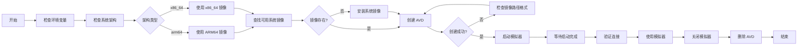

# Android 模拟器快速指南

直接使用核心工具 (`avdmanager`, `sdkmanager`, `emulator`) 管理 Android 虚拟设备。

## 完整流程图



## 前置条件

### 环境变量设置

确保已设置环境变量：
```bash
export ANDROID_HOME=$HOME/Android/Sdk
export PATH=$PATH:$ANDROID_HOME/emulator:$ANDROID_HOME/platform-tools:$ANDROID_HOME/cmdline-tools/latest/bin
```

### 架构兼容性检查

**重要：** 在 Apple Silicon (ARM64) Mac 上，必须使用 ARM64 系统镜像，不能使用 x86_64 镜像。

检查系统架构：
```bash
uname -m
# arm64 = Apple Silicon Mac，需要使用 arm64-v8a 镜像
# x86_64 = Intel Mac，可以使用 x86_64 镜像
```

## 快速开始

### 完整流程示例（Apple Silicon Mac）

```bash
# 1. 检查系统架构
uname -m  # 应该输出 arm64

# 2. 检查可用的 ARM64 镜像
find $ANDROID_HOME/system-images -maxdepth 3 -type d -name "arm64-v8a" 2>/dev/null | sed 's|.*/system-images/||'

# 3. 创建 AVD
avdmanager create avd \
  -n test_emulator \
  -d pixel_6 \
  -k "system-images;android-34;google_apis_playstore;arm64-v8a" \
  -c 2048M \
  -f

# 4. 启动模拟器（后台运行）
emulator -avd test_emulator -no-window -verbose &

# 5. 等待启动完成（约30-60秒）
while [ "$(adb shell getprop sys.boot_completed 2>/dev/null)" != "1" ]; do
  echo "等待启动..."
  sleep 3
done
echo "✓ 模拟器已就绪"

# 6. 验证连接
adb devices

# 7. 清理（可选）
adb emu kill
avdmanager delete avd -n test_emulator
```

## 核心操作

### 1. 列出可用 AVD

查看已创建的所有虚拟设备：

```bash
emulator -list-avds
```

### 2. 创建 AVD

#### 查看可用系统镜像

**查看本地已安装的镜像（推荐）：**

对于 Apple Silicon (ARM64) Mac：
```bash
find $ANDROID_HOME/system-images -maxdepth 3 -type d -name "arm64-v8a" 2>/dev/null | sed 's|.*/system-images/||'
```

对于 Intel (x86_64) Mac：
```bash
find $ANDROID_HOME/system-images -maxdepth 3 -type d -name "x86_64" 2>/dev/null | sed 's|.*/system-images/||'
```

示例输出（ARM64 Mac）：
```
android-34/google_apis_playstore/arm64-v8a
```

示例输出（Intel Mac）：
```
android-34/google_apis_playstore/x86_64
```

**如果没有找到镜像，需要先安装：**
```bash
# ARM64 Mac
sdkmanager "system-images;android-34;google_apis_playstore;arm64-v8a"

# Intel Mac
sdkmanager "system-images;android-34;google_apis_playstore;x86_64"
```

**查看 SDK 中所有可用镜像：**
```bash
sdkmanager --list | grep "system-images"
```

#### 创建新 AVD

**Apple Silicon (ARM64) Mac：**
```bash
avdmanager create avd \
  -n my_emulator \
  -d pixel_6 \
  -k "system-images;android-34;google_apis_playstore;arm64-v8a" \
  -c 2048M \
  -f
```

**Intel (x86_64) Mac：**
```bash
avdmanager create avd \
  -n my_emulator \
  -d pixel_6 \
  -k "system-images;android-34;google_apis_playstore;x86_64" \
  -c 2048M \
  -f
```

**如果出现 "Package path is not valid" 错误：**
1. 确保系统镜像已正确安装
2. 验证镜像目录存在：
   ```bash
   # ARM64 Mac
   ls -la $ANDROID_HOME/system-images/android-34/google_apis_playstore/arm64-v8a/
   
   # Intel Mac
   ls -la $ANDROID_HOME/system-images/android-34/google_apis_playstore/x86_64/
   ```
3. 重新安装系统镜像（见上面的安装命令）

参数说明：
- `-n my_emulator` - AVD 名称
- `-d pixel_6` - 设备配置（可用：pixel_6, pixel_5, pixel_4, Nexus_5X 等）
- `-k "system-images;..."` - 系统镜像路径
- `-c 2048M` - SD 卡大小
- `-f` - 若已存在则覆盖

**查看所有可用设备定义：**
```bash
avdmanager list device
```

### 3. 启动模拟器

#### 基础启动

```bash
emulator -avd my_emulator
```

#### 推荐启动方式（后台运行）

**macOS 推荐启动命令：**
```bash
emulator -avd my_emulator \
  -verbose \
  -show-kernel \
  -gpu swangle_indirect \
  -accel hvf \
  -no-window
```

**如果遇到架构不兼容错误（Apple Silicon Mac）：**
```
PANIC: Avd's CPU Architecture 'x86_64' is not supported by the QEMU2 emulator on aarch64 host
```

解决方案：
1. 检查系统架构：`uname -m`
2. 如果输出是 `arm64`，必须使用 ARM64 系统镜像
3. 删除现有的 x86_64 AVD：`avdmanager delete avd -n <avd_name>`
4. 创建新的 ARM64 AVD（见上面第2节）

#### 启动选项说明

常用选项：
- `-verbose` - 显示详细日志
- `-show-kernel` - 显示内核启动信息
- `-gpu swangle_indirect` - 使用软件渲染（兼容性更好）
- `-accel hvf` - 启用 HVF 硬件加速（macOS，推荐）
- `-accel kvm` - 启用 KVM 硬件加速（Linux）
- `-accel whpx` - 启用 WHPX 硬件加速（Windows Hyper-V）
- `-no-window` - 无窗口模式（后台运行）
- `-port 5554` - 指定 ADB 端口（默认 5554）

**注意：** 模拟器首次启动可能需要 1-3 分钟，请耐心等待。后续启动会更快。

**如果启动缓慢或卡在启动画面：**
1. 确保使用正确的硬件加速：
   ```bash
   # macOS - 检查 HVF 支持
   sysctl kern.hv_support
   # 输出应该是 kern.hv_support: 1
   ```

2. 如果 HVF 不可用，使用软件加速：
   ```bash
   emulator -avd my_emulator -accel off
   ```

3. 增加内存分配：
   ```bash
   emulator -avd my_emulator -memory 4096
   ```

4. 使用冷启动：
   ```bash
   emulator -avd my_emulator -no-snapshot-load
   ```

**如果 GPU 加速导致崩溃：**
```bash
emulator -avd my_emulator -gpu swangle_indirect
```

### 4. 检查模拟器状态

#### 等待模拟器就绪

```bash
# 轮询检查设备状态，直到显示 "1"
while [ "$(adb shell getprop sys.boot_completed 2>/dev/null)" != "1" ]; do
  echo "等待启动..."
  sleep 2
done
echo "✓ 模拟器已就绪"
```

或简单方法：
```bash
# 检查 adb 设备列表
adb devices

# 预期输出：
# emulator-5554   device
```

### 5. 删除 AVD

#### 方法一：使用 avdmanager（推荐）

```bash
# 列出所有 AVD
emulator -list-avds

# 删除特定 AVD
avdmanager delete avd -n my_emulator
```

#### 方法二：手动删除文件

```bash
# 删除 AVD 目录和配置文件
rm -rf ~/.android/avd/my_emulator.avd
rm ~/.android/avd/my_emulator.ini
```

#### 强制关闭模拟器

如果模拟器正在运行，先关闭：
```bash
# 优雅关闭
adb emu kill

# 或强制杀死进程
pkill -f emulator
```

## 相关文档

- [adb_guide.md](adb_guide.md) - 详细的 ADB 命令参考
